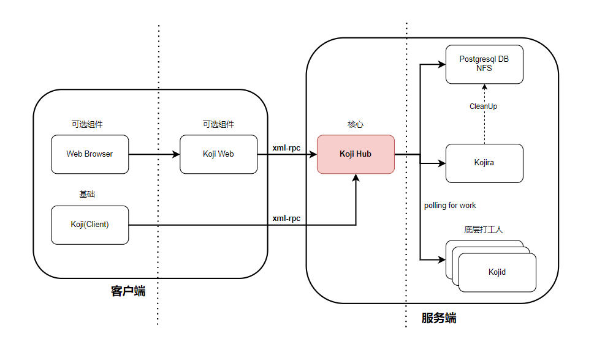
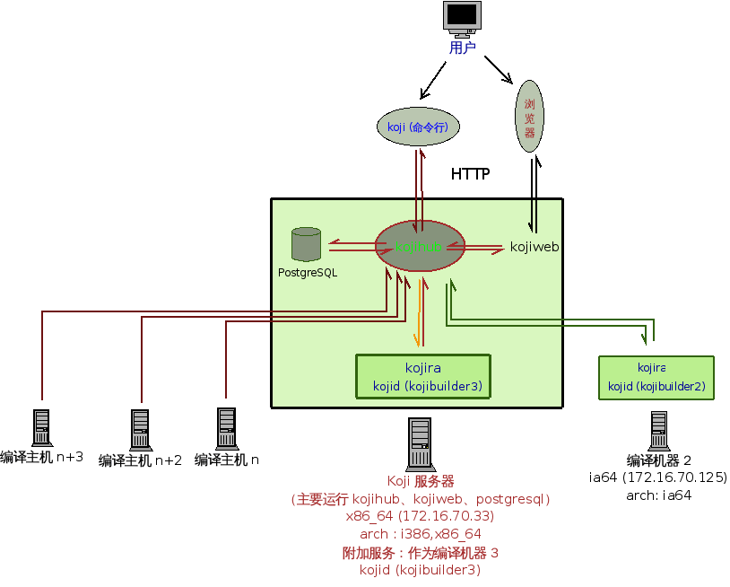
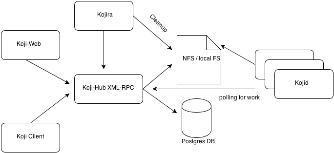

# koji解析

```
Something I hope you know before go into the coding~
First, please watch or star this repo, I'll be more happy if you follow me.
Bug report, questions and discussion are welcome, you can post an issue or pull a request.
```


Koji is an RPM-based build system. The Fedora Project uses Koji for their build system, as do several other projects.

Koji's goal is to provide a flexible, secure, and reproducible way to build software.


* New buildroot for each build
* Robust XML-RPC APIs for easy integration with other tools
* Web interface with SSL and Kerberos authentication
* Thin, portable command line client
* Users can create local buildroots
* Buildroot contents are tracked in the database
* Versioned data

## 相关站点

* <https://pagure.io/koji/>
* <https://docs.pagure.org/koji/>

## 目录

* [koji介绍](docs/koji介绍.md)
* [koji部署](docs/koji部署.md)
* [koji容器化](docs/koji容器化.md)
* [koji源码分析](docs/koji源码分析.md)
    * [帮助信息](docs/koji源码分析/帮助信息.md)
    * [入口解析](docs/koji源码分析/入口解析.md)
    * [调试](docs/koji源码分析/调试.md)
    * [koji如何通过krb5鉴权](docs/koji源码分析/koji如何通过krb5鉴权.md)
    * [ssl证书生成](docs/koji源码分析/ssl证书生成.md)
    * [PostgreSQL入门到入土](docs/koji源码分析/PostgreSQL入门到入土.md)
    * [kojihub如何连接PostgreSQL](docs/koji源码分析/kojihub如何连接PostgreSQL.md)
    * [koji身份认证](docs/koji源码分析/koji身份认证.md)
    * [koji编译rpm基本使用](docs/koji源码分析/koji编译rpm基本使用.md)
    * [koji编译openeuler](docs/koji源码分析/koji编译openeuler.md)


## 图示








 

---
